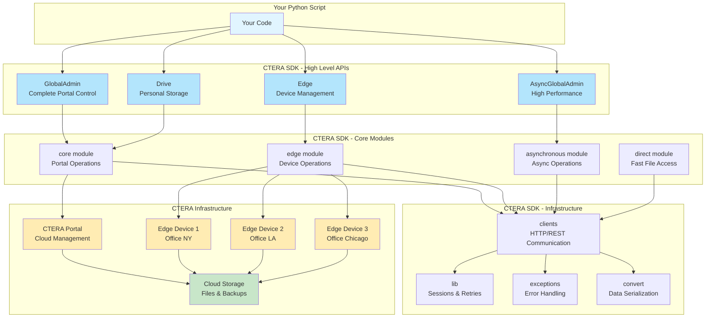
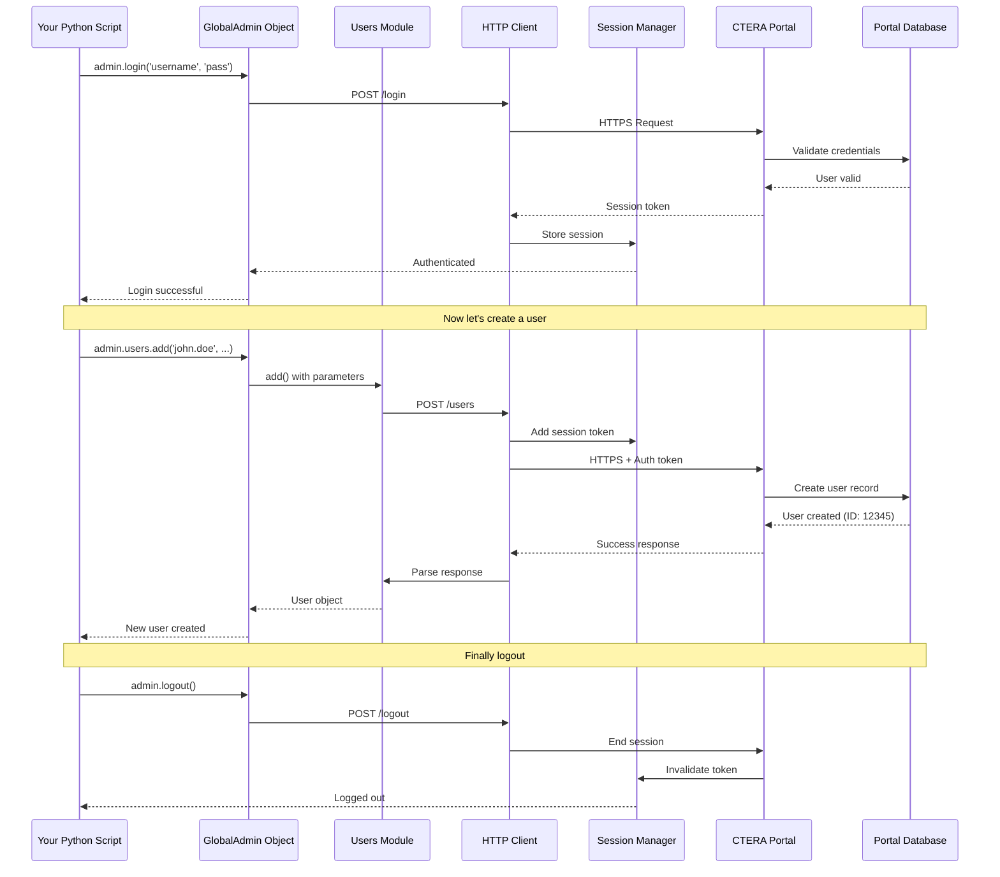

# CTERA Python SDK

[](https://github.com/ctera/ctera-python-sdk/actions?query=workflow%3ACI)
[](https://ctera-python-sdk.readthedocs.io/en/latest)
[](https://pypi.org/pypi/cterasdk)
[](https://opensource.org/licenses/Apache-2.0)
[](https://pypi.org/pypi/cterasdk)

A powerful Python SDK for automating and managing CTERA's Global File System. This library makes it easy to control cloud storage, configure edge devices, manage users, and handle file operations programmatically.

## 🎬 TL;DR - What Is This Repo?

**Imagine you're managing a company's file storage across multiple offices and the cloud.** This SDK is your automation toolkit that lets you write Python scripts to control everything, instead of clicking through web interfaces.

### Real-World Example: Your First Day as IT Admin

Let's say you just joined a company with 50 employees across 3 offices. Here's what you can do with this SDK:

```python
from cterasdk import GlobalAdmin, Edge

# Step 1: Connect to your company's cloud portal
portal = GlobalAdmin('mycompany-portal.ctera.com')
portal.login('admin', 'your-password')

# Step 2: Create accounts for 10 new employees (in seconds, not hours!)
new_employees = [
    {'username': 'sarah.jones', 'email': 'sarah@company.com', 'first': 'Sarah', 'last': 'Jones'},
    {'username': 'mike.chen', 'email': 'mike@company.com', 'first': 'Mike', 'last': 'Chen'},
    # ... 8 more employees
]

for emp in new_employees:
    portal.users.add(emp['username'], emp['email'], emp['first'], emp['last'])
    print(f"✅ Created account for {emp['first']} {emp['last']}")

# Step 3: Set up a new office storage device
office_device = Edge('192.168.10.50')  # IP of device in New York office
office_device.login('admin', 'device-password')

# Create a shared folder for the marketing team
office_device.shares.add('Marketing-Files', '/data/marketing')

# Enable automatic cloud backup
office_device.sync.enable()
office_device.backup.enable()

print("🎉 Done! 10 users created, new office device configured, backups enabled!")
```

**That's it!** In just 20 lines of Python, you've done what would take hours manually.

### 🔧 What Problems Does This Solve?

| Without This SDK | With This SDK |
|------------------|---------------|
| Manually click through web portal to add each user | Run a script, create 100 users in seconds |
| Drive to each office to configure devices | Configure all devices remotely from your laptop |
| Log into each device individually to check status | Query all devices at once and generate reports |
| Manually copy files between systems | Automate file migrations with error handling |
| Hope someone remembered to backup configs | Schedule automated backups with verification |

### 💡 Common Everyday Scenarios

**Scenario 1: New Employee Onboarding**
```python
# Instead of filling forms for 30 minutes...
portal = GlobalAdmin('portal.company.com')
portal.login('admin', 'password')

# Create user, assign to groups, allocate storage - all in one script
portal.users.add('new.employee', 'new@company.com', 'New', 'Employee')
portal.users.add_to_group('new.employee', 'Engineering')
portal.users.set_quota('new.employee', quota_gb=100)
```

**Scenario 2: Office Device Health Check**
```python
# Check all your office devices in a morning report
devices = ['192.168.1.10', '192.168.2.10', '192.168.3.10']  # NY, LA, Chicago

for ip in devices:
    device = Edge(ip)
    device.login('admin', 'password')
    status = device.power.status()
    print(f"Office {ip}: CPU={status.cpu}%, Memory={status.memory}%, Status={status.health}")
```

**Scenario 3: Automated File Cleanup**
```python
# Delete old files automatically (e.g., temp files older than 30 days)
import datetime

portal = GlobalAdmin('portal.company.com')
portal.login('admin', 'password')

files = portal.cloudfs.list_folder('/temp-files')
cutoff_date = datetime.datetime.now() - datetime.timedelta(days=30)

for file in files:
    if file.modified_date < cutoff_date:
        portal.cloudfs.delete(f'/temp-files/{file.name}')
        print(f"🗑️ Deleted old file: {file.name}")
```

## 🏗️ Architecture Overview

Here's how all the pieces fit together:



## 🗺️ SDK Component Flow

This diagram shows how the SDK components work together when you make a typical API call:

```mermaid
flowchart LR
    subgraph "1. Your Application"
        A[Python Script]
    end
    
    subgraph "2. Object Layer"
        B[GlobalAdmin<br/>or Edge Object]
    end
    
    subgraph "3. Module Layer"
        C[Specific Module<br/>users/devices/shares]
    end
    
    subgraph "4. Client Layer"
        D[HTTP Client]
        E[Session Manager]
        F[Retry Logic]
    end
    
    subgraph "5. Data Layer"
        G[Serializers]
        H[Deserializers]
    end
    
    subgraph "6. Transport"
        I[REST API Calls]
    end
    
    subgraph "7. CTERA System"
        J[Portal/Device]
        K[Response]
    end
    
    A -->|"admin.users.add()"| B
    B -->|Route to module| C
    C -->|Prepare request| D
    D --> E
    E --> F
    F --> G
    G -->|JSON/XML| I
    I -->|HTTPS| J
    J -->|Response| K
    K -->|Parse| H
    H -->|Return object| A
    
    style A fill:#e3f2fd
    style B fill:#bbdefb
    style C fill:#90caf9
    style D fill:#fff9c4
    style E fill:#fff59d
    style F fill:#fff176
    style G fill:#c8e6c9
    style H fill:#a5d6a7
    style I fill:#ffccbc
    style J fill:#ff8a65
    style K fill:#ffab91
```



## 🔄 Complete Usage Flow Example

Here's what happens behind the scenes when you run a simple command:



## 🎯 What Does This SDK Do?

Think of CTERA as a global file system that works across cloud and edge devices. This SDK is your remote control for that system. With it, you can:

- **Manage Cloud Storage** - Create and configure cloud portals, set up storage, manage users and permissions
- **Control Edge Devices** - Configure CTERA Edge Filers (network storage devices) remotely
- **Handle Files** - Upload, download, browse, and manage files across your global file system
- **Automate Tasks** - Script repetitive operations like user provisioning, device setup, and backup configurations
- **Monitor Systems** - Query logs, check device status, and track system health

## 🏗️ How Is The Code Organized?

The SDK is split into several main components:

### 📁 Core Components

```
cterasdk/
├── core/          # Portal/Cloud management (the brain of the system)
├── edge/          # Edge device management (local storage devices)
├── asynchronous/  # Async versions of core and edge operations
├── direct/        # Direct data access (high-performance file operations)
├── objects/       # High-level interfaces (GlobalAdmin, ServicesPortal, Edge, Drive)
└── clients/       # HTTP clients and communication layers
```

### 🧠 Core Module (Portal Management)

The `core` module manages your CTERA Portal - the central cloud management system:

- **Users & Groups** - Create, modify, delete user accounts and groups
- **Devices** - Register and manage edge devices
- **Cloud Storage** - Configure cloud sync, backups, and storage policies
- **Administration** - System settings, licenses, reports, and monitoring
- **File Operations** - Browse and manage files in the cloud namespace

**Key Files:**
- `users.py` - User account management
- `devices.py` - Edge device registration and control
- `cloudfs.py` - Cloud file system operations
- `portals.py` - Multi-tenant portal management
- `files/` - File browsing and I/O operations

### 🖥️ Edge Module (Device Management)

The `edge` module controls CTERA Edge Filers - physical or virtual appliances at your locations:

- **Network Configuration** - Set up networking, VPN, routing
- **File Sharing** - Configure SMB, NFS, FTP, AFP shares
- **Local Users** - Manage local device users and permissions
- **Backup & Sync** - Configure cloud sync and backup policies
- **Services** - Enable/disable device services (antivirus, deduplication, etc.)

**Key Files:**
- `shares.py` - File share configuration (SMB/NFS)
- `network.py` - Network settings
- `users.py` - Local user management
- `backup.py` - Backup configuration
- `sync.py` - Cloud synchronization settings

### ⚡ Asynchronous Module

Async versions of core and edge operations for high-performance applications:

- Non-blocking API calls
- Concurrent operations
- Better performance for bulk operations
- Same functionality as synchronous versions

### 📦 Direct Module

High-performance direct data access bypassing REST APIs:

- Fast file downloads directly from cloud storage
- Handles compression and encryption
- Streaming support for large files
- Ideal for data migration and backup tools

### 🎭 Objects Module

High-level interfaces that make the SDK easy to use:

- **GlobalAdmin** - Manage the entire CTERA portal as an administrator
- **ServicesPortal** - Manage multi-tenant services
- **Edge** - Control individual edge devices
- **Drive** - Personal cloud drive operations
- **Async versions** - AsyncGlobalAdmin, AsyncServicesPortal, AsyncEdge

These objects wrap the lower-level modules and provide a clean, intuitive API.

## 🚀 Quick Start

### Installation

```bash
pip install cterasdk
```

### Connect to Portal (Cloud)

```python
from cterasdk import GlobalAdmin

# Connect to your CTERA Portal
admin = GlobalAdmin('portal.example.com')
admin.login('admin-user', 'password')

# Create a new user
admin.users.add('john.doe', 'john@example.com', 'John', 'Doe')

# List all devices
devices = admin.devices.list_devices()

# Browse cloud files
files = admin.cloudfs.list_folder('/users/john.doe')

admin.logout()
```

### Connect to Edge Device

```python
from cterasdk import Edge

# Connect to an edge device
edge = Edge('192.168.1.100')
edge.login('admin', 'password')

# Create a network share
edge.shares.add('SharedFolder', '/path/to/folder')

# Configure cloud sync
edge.sync.enable()

# Check device status
status = edge.power.status()

edge.logout()
```

### Async Operations

```python
from cterasdk import AsyncGlobalAdmin
import asyncio

async def manage_portal():
    admin = AsyncGlobalAdmin('portal.example.com')
    await admin.login('admin-user', 'password')
    
    # Concurrent operations
    users, devices = await asyncio.gather(
        admin.users.list_users(),
        admin.devices.list_devices()
    )
    
    await admin.logout()

asyncio.run(manage_portal())
```

## 📚 What Can You Build With This?

### Automation Scripts
- Bulk user provisioning
- Automated device deployment
- Scheduled backup configurations
- User lifecycle management

### Integration Tools
- Connect CTERA with your identity provider (AD, LDAP)
- Integrate with monitoring systems
- Build custom management dashboards
- Create workflow automation

### Data Management
- Automated file migrations
- Backup verification scripts
- Storage reporting tools
- Data governance automation

### DevOps
- Infrastructure as Code (IaC) for CTERA
- CI/CD integration for configuration management
- Automated testing of storage infrastructure

## 🔧 Common Use Cases

### 1. Bulk User Creation

```python
admin = GlobalAdmin('portal.example.com')
admin.login('admin', 'password')

users = [
    {'username': 'user1', 'email': 'user1@example.com', 'first_name': 'User', 'last_name': 'One'},
    {'username': 'user2', 'email': 'user2@example.com', 'first_name': 'User', 'last_name': 'Two'},
]

for user in users:
    admin.users.add(user['username'], user['email'], user['first_name'], user['last_name'])
```

### 2. Device Configuration Backup

```python
edge = Edge('192.168.1.100')
edge.login('admin', 'password')

# Export configuration
config = edge.config.export()

# Save to file
with open('edge-config-backup.xml', 'w') as f:
    f.write(config)
```

### 3. File Migration

```python
from cterasdk import GlobalAdmin

admin = GlobalAdmin('portal.example.com')
admin.login('admin', 'password')

# Download files from cloud
files = admin.cloudfs.list_folder('/source/path')
for file in files:
    admin.cloudfs.download('/source/path/' + file.name, '/local/destination/' + file.name)
```

## 🧪 Testing

The SDK includes comprehensive unit tests:

```bash
# Install test dependencies
pip install -r test-requirements.txt

# Run tests with tox
tox

# Run specific tests
python -m pytest tests/ut/core/
```

## 📖 Documentation

- **Full API Documentation**: [Read the Docs](https://ctera-python-sdk.readthedocs.io/en/latest/)
- **User Guides**: Located in `docs/source/UserGuides/`
  - Portal Management Guide
  - Edge Device Guide
  - Direct Data Services
  - Miscellaneous Topics

## 🛠️ Development

### Project Structure

```
ctera-python-sdk/
├── cterasdk/           # Main SDK code
│   ├── core/           # Portal management
│   ├── edge/           # Edge device management
│   ├── asynchronous/   # Async operations
│   ├── direct/         # Direct data access
│   ├── objects/        # High-level interfaces
│   ├── clients/        # HTTP clients
│   ├── lib/            # Utilities and helpers
│   ├── common/         # Shared code
│   ├── exceptions/     # Custom exceptions
│   └── convert/        # Data serialization
├── docs/               # Documentation
├── tests/              # Unit tests
└── requirements.txt    # Dependencies
```

### Building Documentation

```bash
cd docs
pip install -r requirements.txt
make html
# Open docs/build/html/index.html
```

## 🔐 Authentication & Security

The SDK supports multiple authentication methods:

- **Username/Password** - Basic authentication
- **Session Management** - Automatic session handling
- **SSL/TLS** - Secure communications
- **Token-based Auth** - For service accounts

## 🐛 Error Handling

The SDK provides detailed exception classes:

```python
from cterasdk import exceptions

try:
    admin.users.add('existing-user', 'email@example.com', 'First', 'Last')
except exceptions.CTERAException as e:
    print(f"Error: {e}")
```

Common exception types:
- `CTERAException` - Base exception
- `ObjectNotFoundException` - Resource not found
- `InvalidCredentialsException` - Authentication failed
- `NetworkException` - Connection issues

## 📋 Requirements

- Python 3.10 or higher
- Network access to CTERA Portal or Edge devices
- Valid credentials with appropriate permissions

## 🤝 Contributing

Contributions are welcome! The codebase follows standard Python conventions:

- PEP 8 style guide
- Type hints where applicable
- Comprehensive unit tests
- Clear documentation

## 📄 License

Apache License 2.0 - See [LICENSE](LICENSE) file for details

## 🔗 Useful Links

- [PyPI Package](https://pypi.org/project/cterasdk/)
- [Official Documentation](https://ctera-python-sdk.readthedocs.io/)
- [Issue Tracker](https://github.com/ctera/ctera-python-sdk/issues)
- [CTERA Website](https://www.ctera.com/)

## 💡 Tips & Best Practices

1. **Always logout** - Use `try/finally` or context managers to ensure clean disconnections
2. **Use async for bulk operations** - Better performance when handling many devices or users
3. **Enable logging** - The SDK uses Python's logging module for debugging
4. **Test in dev first** - Always test scripts in a development environment
5. **Handle exceptions** - Network issues and API errors can happen, plan accordingly

## 🎓 Learning Path

1. **Start with Objects** - Use `GlobalAdmin` and `Edge` classes for simple scripts
2. **Explore Modules** - Dive into specific modules (users, devices, shares) for advanced features
3. **Try Async** - Use asynchronous operations for performance-critical applications
4. **Read the Docs** - Check the full API documentation for detailed information

## 🌟 Why Use This SDK?

- **Comprehensive** - Complete coverage of CTERA Portal and Edge APIs
- **Well-Documented** - Extensive documentation and examples
- **Production-Ready** - Used in real-world deployments
- **Actively Maintained** - Regular updates and bug fixes
- **Type-Safe** - Type hints for better IDE support
- **Tested** - Comprehensive test suite

---

**Made with ❤️ by CTERA Networks**

For questions, issues, or contributions, visit the [GitHub repository](https://github.com/ctera/ctera-python-sdk)

